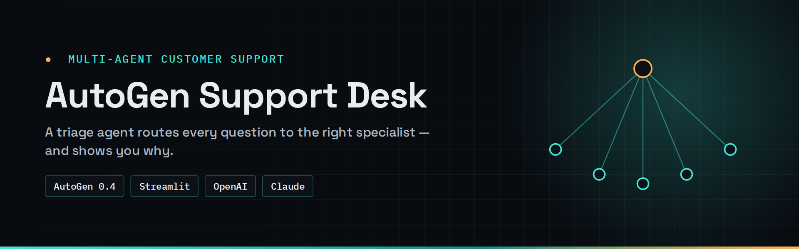
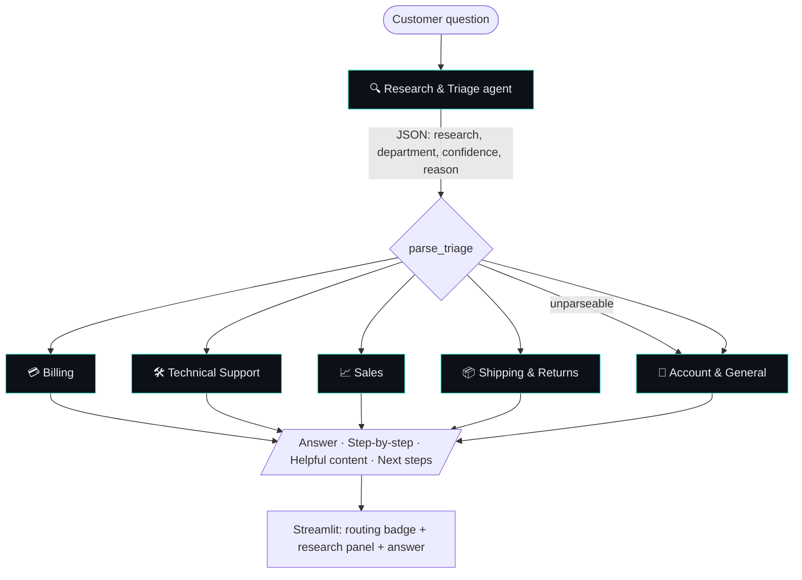

<div align="center">



# AutoGen Support Desk

**A multi-agent customer-support bot that triages every question to the right department — and shows you why.**

[](https://github.com/Hariharan17194/autogen-support-desk/actions/workflows/ci.yml)
[](https://github.com/Hariharan17194/autogen-support-desk/releases)


[](LICENSE)

</div>

---

## ✦ Why this exists

In real support operations, the slowest part of a ticket is often the **first hop** — figuring out who should own it. Misrouted tickets bounce between teams and customers wait. This project models that first hop as an AI **Research & Triage agent**, then hands the ticket to a **department specialist agent** that writes a structured, customer-ready reply.

Built by someone who spent 2+ years answering those tickets by hand.

## ✦ Skills demonstrated

**Agentic AI** · AutoGen AgentChat · multi-agent routing · structured LLM output · defensive parsing · specialist handoffs · prompt design · Streamlit · automated tests

**Course progression:** turns the Week 5 AutoGen concepts—agents, messages, teams, tools and handoffs—into a support workflow with explicit routing, confidence and a safe fallback path.

## ✦ How it works



| Department | Handles |
|---|---|
| 💳 Billing | payments, invoices, refunds, pricing, subscriptions |
| 🛠️ Technical Support | bugs, errors, setup, login problems, integrations |
| 📈 Sales | product info, plans, features, demos, upgrades |
| 📦 Shipping & Returns | order tracking, delivery, returns, exchanges |
| 👤 Account & General | account settings, privacy, security, feedback, fallback |

## ✦ Features

- **Two-stage agent pipeline** — triage first, specialist second (AutoGen AgentChat 0.4+).
- **Explainable routing** — department, confidence score and research notes shown for every answer.
- **Safe fallback** — unreadable triage output routes to *Account & General* instead of failing.
- **Model choice** — OpenAI (`gpt-4o-mini`, `gpt-4o`) or Anthropic Claude, picked in the sidebar.
- **Config-driven departments** — edit one dict in `agents.py`; prompts and UI update automatically.

## ✦ Quick start

```bash
git clone https://github.com/Hariharan17194/autogen-support-desk.git
cd autogen-support-desk
python -m venv .venv && .venv\Scripts\activate        # macOS/Linux: source .venv/bin/activate
pip install -r requirements.txt
cp .env.example .env                                    # add OPENAI_API_KEY and/or ANTHROPIC_API_KEY
streamlit run app.py
```

Try these:

| Question | Expected route |
|---|---|
| *I was charged twice for my subscription this month.* | Billing |
| *The app crashes when I upload a file larger than 10 MB.* | Technical Support |
| *What's the difference between Basic and Pro?* | Sales |
| *My order hasn't arrived after 10 days.* | Shipping & Returns |
| *How do I turn on two-factor authentication?* | Account & General |

## ✦ Project structure

```text
├── agents.py          # departments, prompts, model client, AutoGen pipeline, triage parser
├── app.py             # Streamlit chat UI
├── tests/             # pytest: triage parsing & department matching (no API calls)
├── requirements.txt
└── .env.example
```

## ✦ Design decisions

- **Router returns JSON, parsed defensively** — regex-extracts the first `{…}` block, falls back gracefully. Structured output via Pydantic is on the roadmap.
- **Sequential, not group chat** — a fixed two-hop pipeline is cheaper and more predictable than a free-form multi-agent conversation for triage.

## ✦ Roadmap

- [ ] Routing-accuracy eval set (50 labelled tickets) with the score in this README
- [ ] Knowledge-base retrieval per department (RAG)
- [ ] Human-in-the-loop handoff when confidence < threshold
- [ ] Dockerfile + one-click deploy

## ✦ License

[MIT](LICENSE) © 2026 Hariharan Padmanabhan
